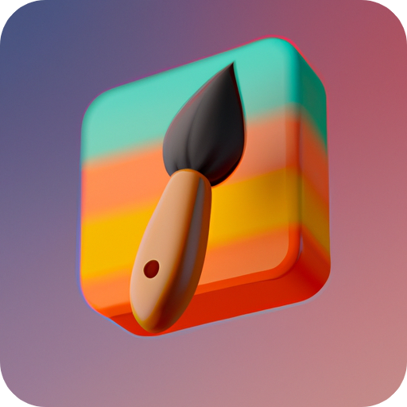

<!-- main content -->

<h1><strong>DoodleGrid</strong></h1>

Try it here: <a href="https://DoodleGrid.io/">https://DoodleGrid.io/</a>
 
<h2>DoodleGrid is a highly interactive and user-friendly web application that allows users to unleash their creative side by drawing on a 10x10 grid of pixels using any color of their choice. With the ability to easily download and share your artwork, DoodleGrid is a perfect platform for artists, designers, and anyone who wants to express their creativity in a fun and engaging way. Whether you're looking to create simple designs or intricate masterpieces, DoodleGrid is the perfect canvas for you to unleash your imagination and let your creativity flow!</h2>
 

<!-- copyright notice -->

© 2023 <a href="https://DoodleGrid.io/">DoodleGrid</a>. All rights reserved.

<!-- MIT license badge -->
